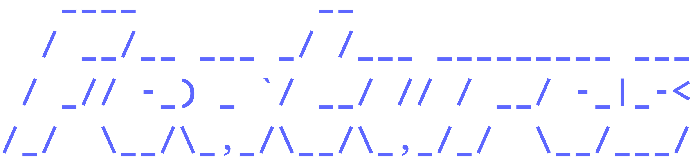
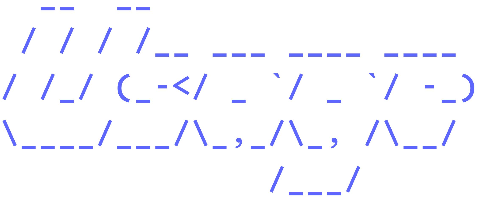
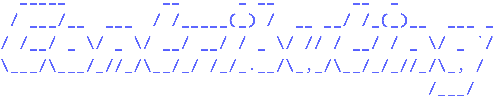

# <p align="center"></p>

<p align="center">"<strong>W</strong>hy <strong>T</strong>he <strong>F</strong>*** Is This Not Working?"</p>

wtf is a simple program made in Go meant to check the commands you run (or programs you give it) for common known errors that are in the wtf database (which you can add your own fixes to if one does not exist yet!).

The program is named "wtf" mainly because it shows the frustration that a programmer has to go through while fixing bugs.

# <p align="center"></p>

- Easy debugging in files & commands
- Simple library which is easy to expand
- Quick execution using Go
- Easy to understand command
- Diagnoses both a failing command's output *and* individual files — point it at either one
- Built-in checkers for JavaScript, Python, Go, and Rust, with line/column locations pulled straight out of the error
- Runs `node --check` first on JS files, so syntax errors get caught before the script is even executed
- Fix database is just JSON — add a new known error without touching any Go code
- Optional log file (`-l`) so you can keep a running record of what it's caught
- A pre-commit hook that runs the checkers against known-broken test fixtures, so a change can't silently break error detection

# <p align="center"></p>

You'll need [Go](https://go.dev/dl/) installed. Then:

```bash
git clone https://github.com/RandomGuy4114/wtf.git
cd wtf
make install
```

`make install` runs `go install .`, which puts the `wtf` binary in `$(go env GOPATH)/bin` — make sure that's on your `PATH`, or `wtf` won't be found after installing. It also points git at this repo's `hooks/` directory, which runs `wtf` against the fixtures in `tests/` before every commit to catch regressions in the checkers.

If you'd rather just build a local binary without installing it system-wide:

```bash
make build   # outputs to bin/wtf
```

# <p align="center"></p>

`wtf` works two ways: run a command and diagnose its output, or check a file directly. At least one of `-r` or `-f` is required.

**Run a command:**

```bash
wtf -r "npm run build"
```

If the command fails, `wtf` scans the output for known error patterns and prints the likely cause and a fix.

**Check a file:**

```bash
wtf -f script.js
```

This runs the file through its own checker — JavaScript via `node`, Python via `python3`, Go via `go vet`/`go run`, Rust via `rustc` — and diagnoses any syntax or runtime errors, including the line and column, when it can find one.

**Both at once:**

```bash
wtf -r "node script.js" -f script.js
```

If the command fails, `wtf` also runs the file-specific checker against `script.js` for a more targeted diagnosis on top of the general command-output matching.

### Flags

| Flag | Description |
|------|-------------|
| `-r` | Command to run |
| `-f` | File to check for errors |
| `-l` | Log file to append diagnosis output to (optional) |
| `-v` | Print version info and exit |

`-r`, `-f`, and `-l` can also be set via the `COMMAND`, `FILE`, and `LOG_FILE` environment variables, if you'd rather not type them every time.

# <p align="center"></p>

Found an error `wtf` doesn't recognize yet? The quickest way to help is to add it to the relevant JSON module in `checkers/modules/json/` — each entry just needs a string (or strings) to match against the error output, a human-readable message, and a fix. No code required for that.

Adding a new language checker? Take a look at `checkers/file/js.go`, `checkers/file/go.go`, or `checkers/file/rust.go` as a starting point — they all follow the same shape: run the thing, capture the output, and hand it off to the shared `diagnose()` helper in `checkers/file/utils.go`, which does the JSON matching, location lookup, and printing for you. Then wire the new extension into `checkers/file/file.go`'s `Check` dispatcher.

Before committing, `make test` and `make vet` should both pass. The pre-commit hook (set up automatically by `make install`) will also run `wtf` against the fixtures in `tests/` to make sure the checkers still catch what they're supposed to.

<p align="center"><em>Made with ❤️ By FormalBlaze</em></p>